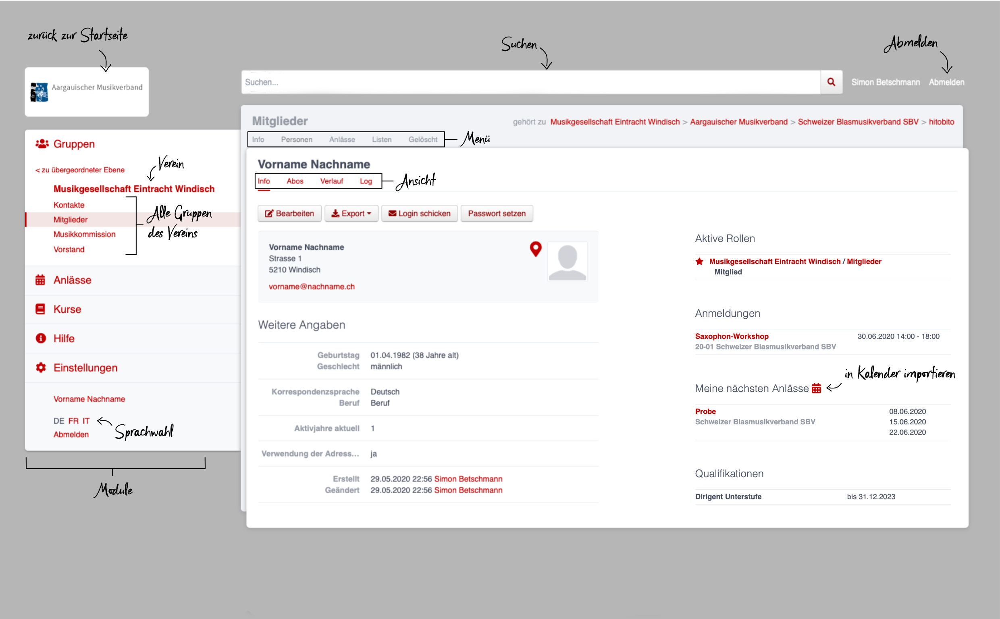
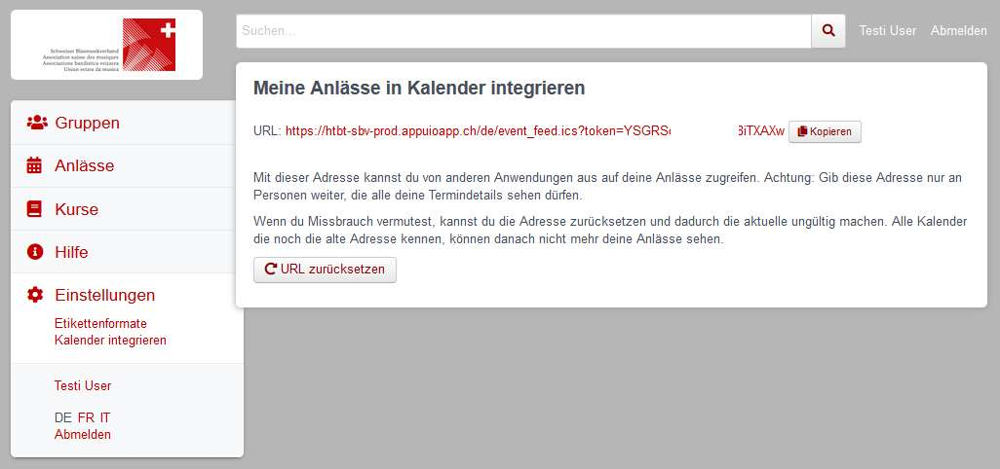

# Startseite Benutzer

## Übersicht

  - Module  
    In der Modulauswahl können Sie das gewünschte Modul wählen: Gruppen
    | Anlässe | Kurse | Rechnungen | Hilfe | Einstellungen.

  - Menü  
    Im Modul Gruppen hat jede Gruppe verschiedene Menüpunkte, welche je
    nach Berechtigung angezeigt werden (z.B. Info, Personen, Anlässe,
    Listen, Gelöscht etc.)

  - Personen haben zudem folgende Ansichten:  
    Info | Abos | Verlauf | Log.

  - Befehle  
    Abhängig von den Ihnen zugewiesenen Gruppen und Rollen, stehen Ihnen
    in den verschiedenen Modulen und Ansichten unterschiedliche Befehle
    zur Verfügung.

  - Suchen  
    Im Suchfeld kann nach Personen, Vereinen, Verbänden, Anlässen,
    Kursen etc. gesucht werden.

  - Sprachauswahl  
    Es kann zwischen den Sprachen Deutsch | Französisch | Italienisch
    umgeschaltet werden.

  - Abmelden  
    Mit dem Abmelden-Link wird der Benutzer von hitobito abgemeldet.

Logo Ein Klick auf das Logo des Vereins bzw. Verbandes führt zur
Startseite des Benutzers, d.h. zur Startseite der Hauptgruppe.

  - Aktive Rollen  
    Übersicht über alle aktiven Rollen des Benutzers. Ist ein Benutzer
    Mitglied mehrerer Vereine oder Verbände, markiert ein ausgefüllter
    Stern die sog. Hauptgruppe. Um die Hauptgruppe zu wechseln klicken
    Sie auf einen nicht ausgefüllten Stern neben einem Verein bzw.
    Verband.

## Suchen

In einem Dropdown-Menü unter dem Suchfeld werden die ersten Treffer als
Live-Resultate angezeigt, d.h. sie passen sich bei jedem weiteren
Buchstaben an. Klickt man auf das Lupe-Icon rechts neben dem Suchfeld,
erscheint das vollständige Suchresultat. Es werden nur Resultate
gefunden, auf welche der Benutzer auch Zugriff hat.

## Ansicht Info

In der Ansicht Info sehen Sie - sofern Sie die Berechtigung dazu haben
- die Personalien einer Person sowie weitere Angaben wie zum Beispiel
die vom System anhand der eingetragenen Rollen berechnete Zahl der
Aktivjahre. Ausserdem werden die aktiven Rollen angezeigt, wobei die
Hauptgruppe mit einem ausgefüllten roten Stern markiert ist.

Auf Ihrer eigenen Seite - und bei anderen Personen, sofern Sie die
entsprechende Berechtigung haben - stehen Ihnen folgende Befehle zur
Verfügung: 

  - Bearbeiten  
    Ändern der Angaben zur Person

  - Löschen  
    Löschen der Person

  - Rechnung erstellen  
    Erstellen einer Rechnung für diese Person

  - Export  
    Herunterladen der angezeigten Daten in verschiedenen Formaten (CSV,
    PDF, Excel etc.).

  - Login schicken  
    Dieser Befehl schickt dem Benutzer ein E-Mail mit dem Link zum
    setzen eines Passwortes. Fährt man mit der Maus über diesen Button
    erscheint die Information, ob der Benutzer bereits ein Login hat,
    oder nicht.

  - Imitieren  
    Übernehmen der Berechtigungen einer Person, d.h. Ansicht von
    hitobito aus der Perspektive dieser Person.

  - Passwort ändern  
    Ändern Sie ihr Passwort zum Anmelden bei hitobito. Sie können nur
    ihr eigenes Passwort ändern.

Auf der rechten Seite findet sich eine Übersicht aller aktuellen Rollen
der Person, der ihr zugeordneten Tags, ihrer Anmeldungen für kommende
Anlässe und Kurse sowie ihrer erworbenen Qualifikationen.

Über die Funktion  `in Kalender
integrieren` kann jeder Benutzer eine URL generieren, welche er in
seiner Kalender.app abonnieren kann. Diese Funktion steht zur Zeit nur
bei den Anlässen zur Verfügung.

## Ansicht Abos

Auflistung, in welcher Mailingliste der Benutzer eingetragen ist.

## Ansicht Verlauf

In der Ansicht "Verlauf" finden Sie eine Übersicht aller `Gruppen →
Rollen`, welche die Person aktuell und in der Vergangenheit hatte. Bei
vergangenen Rollen ist ein Von- und Bis-Datum vermerkt; bei aktuellen
Rollen nur ein Von-Datum.

Ebenfalls werden hier die Anlässe der Person aufgelistet, zu welchen sie
angemeldet ist bzw. war.

![Abbildung Startseite Benutzer → Verlauf \[Ansicht Rechnungen
hinzufügen\]](media/image10.png)

## Ansicht Log

In der Ansicht "Log" können Sie nachverfolgen wer wann welche
Informationen über Sie geändert hat.

## Ansicht Rechnungen

In der Ansicht "Rechnungen" finden sich alle Rechnungen, welche der
Person geschickt wurden.

Attention

Es ist noch unklar, wer die Ansicht "Rechnungen" sehen kann → abklären
mit hitobito

# Modul Gruppen

## Menü Info

Unter dem Menüpunkt "Info" kann für jede Gruppe eine Kontaktperson
ausgewählt oder eine "Vereinsadresse" definiert werden. Je nach
Gruppentyp stehen zudem weitere Angaben (Beschreibung,
Korrespondenzsprache, Gründungsjahr etc.) zur Verfügung.

Attention

Die im Menü "Info" definierte Adresse (explizit angegebene
Vereinsadresse oder Auswahl einer Kontaktperson) wird zum Beispiel als
Absender bei E-Mails verwendet.

## Menü Personen

Im Menü "Personen" werden -- bei einem eigenen Verein -- in der
Grundeinstellung alle Mitglieder der Gruppe mit einer bestimmten
Funktion angezeigt. Dieser Menüpunkt ist bei fremden Vereinen nicht
sichtbar.

Über den Button `Spalten` kann eingestellt werden, welche Angaben in der
Übersicht angezeigt werden sollen. Mit den Befehlen `Export` bzw.
`Drucken` können die angezeigten Daten heruntergeladen bzw. ausgedruckt
werden.

**Beispiel**: Ist ein eigener Verein ausgewählt, werden die besonderen
Funktionen Administrator, SUISA-Verantwortlicher und Dirigent angezeigt:

Über die Funktion `Weitere Ansichten` können alle Personen ("Gesamte
Ebene") angezeigt oder ein Filter gesetzt werden.

**Beispiel**: Ist die Gruppe `Mitglieder` eines eigenen Vereins
ausgewählt, werden alle Personen dieser Gruppe angezeigt, also die
Liste aller Aktivmitglieder.

Bei der Gruppe `Vorstand`, werden alle Personen dieser Gruppe angezeigt,
also die Liste aller Vorstandsmitglieder.

Wird eine oder mehrere Personen markiert (Haken ganz links in der
Liste), erscheinen weitere Befehle, mit welchen alle markierten Personen
gleichzeitig bearbeitet werden können:

## Menü Anlässe

Unter dem Menüpunkt Anlässe werden die vom angezeigten Verein erstellten
(wenn die Gruppe "Verein" ausgewählt ist) bzw. die von der jeweiligen
selektierten Untergruppe erstellten Anlässe aufgelistet. Hier können
sich die Mitglieder für die Anlässe anmelden, die Anlässe exportieren
oder direkt in den Kalender eintragen (mit Hilfe einer iCalendar-Datei).

Auf der Ebene eines Kantonalverbands können sämtliche Anlässe des
Verbandsgebiets und auf der Ebene Schweizer Blasmusikverband alle
Anlässe des SBV angezeigt werden.

## Menü Musikfeste

Dieser Menüpunkt ist nur für Administratoren ersichtlich. Hier können
sich die Vereine für die ausgeschriebenen Musikfeste anmelden.

## Menü Listen

Im Menüpunkt "Listen" werden dem Mitglied sämtliche Mailinglisten der
selektierten Gruppe, d.h. des Vereins oder einer seiner Gruppen,
angezeigt. Je nach Konfiguration durch den Administrator können diese
"Weiterleitungsadressen" auch von den Mitgliedern benutzt werden.

## Menü Anfragen

Dieser Menüpunkt ist nur für Administratoren ersichtlich.

## Menü Notizen

Hier sind die unter dem Menüpunkt Info erfassten Notizen zum Verein oder
zur Gruppe aufgelistet. Man sieht auch die notizen der untergruppen.
Dieser Menüpunkt ist nur für Administratoren ersichtlich.

## Menü Gelöscht

Unter dem Menüpunkt Gelöscht werden frühere, inzwischen gelöschte
Untergruppen des Vereins angezeigt.

## Menü API-Keys

Dieser Menüpunkt ist nur für Administratoren ersichtlich. Für die
technische Anbindung an Webseiten oder Apps können hier sog. API-Keys
generiert werden.

# Modul Anlässe

Hier werden Anlässe von Gruppen, bei denen der Benutzer Mitglied ist,
sowie deren Übergruppen angezeigt.

Beispiele:

  - Anlässe des SBV werden bei allen Mitgliedern angezeigt
  - Anlässe des Aargauischen Musikverbandes (AMV) werden nur Mitgliedern
    angezeigt, die dem AMV angehören
  - Anlässe der Musikgesellschaft Eintracht Windisch (MGE) werden nur
    Mitgliedern der MGE angezeigten

Andere Anlässe sind bei der organisierenden Gruppe zu finden. Will sich
ein Mitglied des Zürcher Blasmusikverbands über Anlässe im Aargau
informieren, kann sich das Mitglied die entsprechenden Anlässe im Modul
Gruppen → Schweizer Blasmusikverband SBV → Aargauischer Musikverband →
Menü Anlässe anzeigen lassen.

# Modul Kurse

Hier werden Kurse von Gruppen, bei denen der Benutzer Mitglied ist,
sowie deren Übergruppen angezeigt. Andere Kurse sind bei der
organisierenden Gruppe zu finden.

# Modul Hilfe

Im Modul Hilfe sind verschiedene Hilfe-Resourcen hinterlegt, wie zum
Beispiel Videoanleitungen und dieses Benutzerhandbuch.

# Modul Einstellungen

Im Modul Einstellungen kann das Mitglied eigene **Etikettenformate**
definieren, welche für den Druck von (Personen-)Listen verwendet werden
können.

Unter **Kalender integrieren** kann eine URL generiert werden, um von
anderen Anwendungen aus (z.B. Microsoft Outlook, Apple Kalender) auf die
eigenen Anlässe zuzugreifen. Achtung: Diese Adresse nur an Personen
weitergeben, die alle Termindetails sehen dürfen. Bei einem Missbrauch
kann die URL hier auch zurückgesetzt werden. Alle Kalender die noch die
alte Adresse kennen, können die Anlässe danach nicht mehr anzeigen.

1.  Adresse erstellen
2.  Link kopieren

3.  Outlook öffnen und in den Kalender wechseln

Über Start das Menü **Kalender öffnen** (2) wählen und mit **Aus dem
Internet** (3) ein zusätzliches Fenster öffnen. Hier im leeren Kasten
die aus hitobito kopierte URL einfügen (4) und mit OK (5) bestätigen.
Über Erweitert (6) kann ein Ordnername und eine Beschreibung (7)
eingegeben werden. Zum Abschliessen mit OK (8) und Ja (9) bestätigen.

Mit dem Abschliessen wird in Outlook unter Andere Kalender der neue
Kalender mit den eigenen Anlässen aus HITOBITO angezeigt und immer
wieder aktualisiert:

