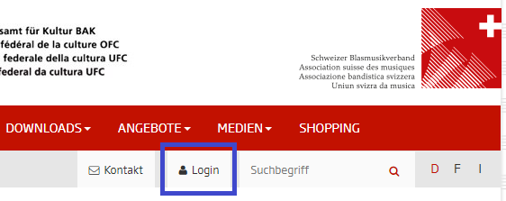
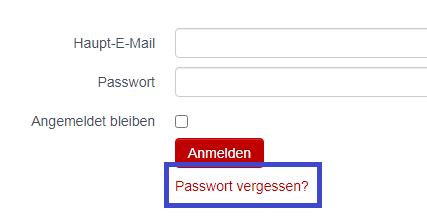

# Grundlegendes über hitobito

Anfang 2019 hat der Schweizerischen Blasmusikverbandes SBV hitobito als neue Verbandsverwaltungssoftware eingeführt. Dies mit dem Ziel, den Aufwand für die Datenpflege zu reduzieren, Redundanzen zu beseitigen und zusätzlichen Nutzen für die Anwender und die angegliederten Verbände zu generieren.

## Was ist hitobito?

hitobito bietet einen echten Mehrwert für Verbände und Vereine, zumal die Vereinsdaten nur noch einmal eingeben zu müssen. Ein richtiger Gewinn wird es aber nur wenn die Daten hier vollständig sind und gepflegt werden.

## Wie funktioniert hitobito?

Je nach Aufgabe und Funktion im Verband bzw. im Verein hat eine Person in hitobito unterschiedliche Rollen zugeteilt. Anhand dieser Rollen erhält sie auch entsprechende Berechtigungen. Je nach Rolle kann sie Vereinsmitglieder administrieren, Anlässe erfassen, Listen exportieren, Rechnungen stellen etc.

Die verschiedenen Rollen sind in unterschiedliche Gruppen aufgeteilt. In einem Verein gibt es unter anderem die Gruppen:

* <Verein> mit den Rollen Administrator, Verantwortlicher SUISA, Dirigent
* Vorstand mit den Rollen Präsident, Kassier und Mitglied
* Mitglieder mit den Rollen Adressveraltung, Mitglied, Passivmitglied und Ehrenmitglied
* Musikkommission mit den Rollen Präsident und Mitglied

**Beispiel** Eine Person mit der Berechtigung `Vorstand → Präsident` kann alle Angaben seines Vereins lesen und bearbeiten und Anlässe erstellen. Der Vereinskassier mit der Berechtigung `Vorstand → Kassier` kann ebenfalls alle Angaben seines Vereins lesen und bearbeiten. Er kann aber keine Anlässe erfassen. Dafür kann er Rechnungen erstellen und verwalten.

Personen mit der Berechtigung `Mitglieder → Mitglied` können nur ihre eigenen Daten sehen und bearbeiten.

Kantonal- und Regionalverbände haben daneben noch weitere Gruppen und Rollen. Für eine vollständige Übersicht aller möglichen Gruppen und Rollen vgl. Anhang 1: Gruppen und Rollen.

## Datenschutz
  
Die Daten in hitobito dürfen nur im Zusammenhang mit Aktivitäten des SBV und dessen Kantonalverbänden oder im eigenen Verein verwendet werden. Grundsätzlich dürfen fremde Personendaten nicht an Drittpersonen oder andere Organisationen weitergegeben werden. Der SBV gibt ohne Einwilligung der Betroffenen keine Daten an Drittpersonen heraus.

Die Server von hitobito stehen in der Schweiz und sind ISO und FINMA zertifiziert.

    Einige der in diesem Handbuch beschriebenen Funktionen sind nur für Personen mit speziellen Berechtigungen verfügbar. Sie sind zur Kennzeichnung mit einem -Symbol versehen.

## Erste Schritte mit hitobito

Jedes Vereinsmitglied kann in hitobito mit der Berechtigung ``Mitglieder → Mitglied`` seine eigenen Daten anschauen selber ändern. Das Mitglied hat die Möglichkeit einfache Abfragen im eigenen Verein bzw. Verband zu tätigen und zum Beispiel jederzeit eine aktuelle Aktivmitgliederliste des eigenen Vereins anzuzeigen, zu exportieren und auszudrucken. Auf die Mitgliederdaten anderer Vereine haben Mitglieder keinen Zugriff.

# Anmelden

Unter https://www.windband.ch befindet sich (rechts oben in der Navigationsleiste) das Login zu hitobito.

Wenn Sie sich zum ersten Mal anmelden oder wenn Sie das Passwort vergessen haben, klicken Sie auf den Link ``Passwort vergessen?`` unterhalb des Anmelden-Buttons.

Im nächsten Schritt geben Sie Ihre E-Mailadresse ein und klicken Sie auf den Button ``Passwort zurücksetzen``.

Als Benutzername bzw. Haupt-E-Mailadresse wird die **persönliche** E-Mailadresse genutzt, mit der jedes Mitglied in der Datenbank geführt wird.

**Wichtig:** Die Mitglieder sollen mit ihren persönlichen E-Mailadressen in hitobito eingetragen werden. Werden sog. Funktionsadressen (z. B. praesident@xxx.ch) verwendet, müssen diese Adressen später immer wieder geändert werden, wenn das Mitglied in seinem Verein die Funktion wechselt, weil sein Nachfolger die gleiche E-Mailadresse nicht eintragen kann, solange diese noch vom Vorgänger verwendet wird.
